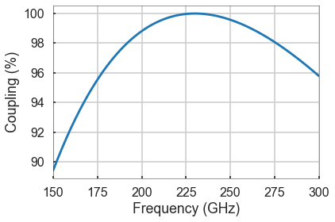

Gaussopt Example
================

-  This example will walk through the basics of setting up a Gaussian
   telescope.
-  Note: All distances are in mm and all frequencies are in GHz unless
   specified otherwise.

.. code:: ipython2

    # Import the gaussopt package
    from gaussopt import *
    
    # Import modules for this notebook
    import matplotlib.pyplot as plt 
    %matplotlib inline
    from IPython.display import Image

-  Gaussian telescopes use two mirrors to couple energy between two horn
   antennas. If the mirrors have focal lengths :math:`f`, then the
   mirrors should be separated by :math:`2f` and the distance between
   each horn's beam waist and it's respective mirror should be
   :math:`f`.

Define frequency sweep
----------------------

-  The standard way to initialize this class is to define the start and
   end frequency.
-  This class assumes GHz unless a unit is provided.

.. code:: ipython2

    freq = Frequency(150, 300, comment='rf sweep')

.. parsed-literal::

    Frequency sweep: rf sweep
    	f = 150.0 to 300.0 GHz, 301 pts
    

Define horns
------------

.. code:: ipython2

    slen = 22.64  # slant length (in mm)
    arad = 3.6    # aperture radius (in mm)
    hfac = 0.59   # horn factor
    horn_tx = Horn(freq, slen, arad, hfac, comment='Trasmitting')
    horn_rx = horn_tx.copy(comment='Receiving')

.. parsed-literal::

    Horn: Trasmitting
    	slen = 22.64 mm
    	arad =  3.60 mm
    	hf   =  0.59
    
    Horn: Receiving
    	slen = 22.64 mm
    	arad =  3.60 mm
    	hf   =  0.59
    

Define optical components
-------------------------

-  These classes will assume mm unless a unit is provided.

.. code:: ipython2

    d = Freespace(160)
    m1 = Mirror(16, units='cm', radius=8, comment='M1')
    m2 = Mirror(16, units='cm', radius=8, comment='M2')

.. parsed-literal::

    Freespace: 
    	d = 160.0 mm
    
    Mirror: M1
    	f = 16.0 cm
    
    Mirror: M2
    	f = 16.0 cm
    

-  Note that the distance between the horn and the mirror needs to be
   reduced because the actual beam waist will be behind the horn
   aperture.

.. code:: ipython2

    z_offset = horn_tx.z_offset(units='mm')[freq.idx(230)]
    d_red = Freespace(160 - z_offset, comment='reduced')

.. parsed-literal::

    Freespace: reduced
    	d = 155.8 mm
    

Build Optical System
--------------------

.. code:: ipython2

    component_list = (d_red, m1, d, d, m2, d_red)
    
    system = System(horn_tx, component_list, horn_rx)

.. parsed-literal::

    System: 
    [[-1.          0.00848684]
     [ 0.         -1.        ]]

Plot Coupling
-------------

.. code:: ipython2

    system.plot_coupling()
    system.print_best_coupling()

.. parsed-literal::

    Best coupling: 100.0 % at 230.0 GHz

Plot Beam Propagation
---------------------

.. code:: ipython2

    fig, ax = plt.subplots(figsize=(8,5))
    system.plot_system(ax=ax)

.. image:: _images/output_16_0.png

