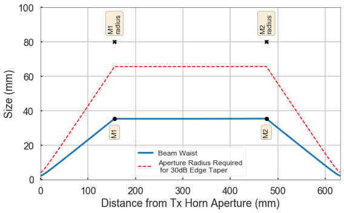

Example Workflow for the GaussOpt Package
=========================================

Gaussian Telescope
~~~~~~~~~~~~~~~~~~

**Description:** This notebook shows an example of how to use the
'gaussopt' module to evaluate a system. Benefits of using the 'gaussopt'
module:

**1.** You can do frequency sweeps: you are given results over a range
of frequencies, instead of just one single frequency.

**2.** You can do distance sweeps: You are able to sweep any variable
you like, and see how that affects coupling/tapers/etc.

In this example, I set up a Gaussian beam telescope (GBT) that is
roughly based on my own experimental setup. All of the mirrors have
focal lengths of 160 mm. GBTs are theoretically frequency independent;
however, the beam waist offset from the horn apertures is not. This can
affect coupling as we'll see in this example.

.. code:: ipython2

    import gaussopt as go
    import numpy as np
    import matplotlib.pyplot as plt 
    %matplotlib inline
    
    GHz = 1e9 

Define frequency range
~~~~~~~~~~~~~~~~~~~~~~

Note: Wavelength is returned in mm!

.. code:: ipython2

    frequency, index_center = go.frequency_sweep(center=230e9, span=50e9)
    
    wavelength = go.freq_to_wavelength(frequency)

Calculate beam parameters of transmitting (Tx) horn
~~~~~~~~~~~~~~~~~~~~~~~~~~~~~~~~~~~~~~~~~~~~~~~~~~~

.. code:: ipython2

    slen = 22.64  # slant length (in mm)
    arad = 3.6  # aperture radius (in mm)
    hfac = 0.59  # horn factor
    
    q_tx, waist_tx, z_offset_tx = go.horn(slen, arad, hfac, wavelength)
    
    print "Tx horn waist:    \t %f mm \t at f = 230 GHz" % (waist_tx[index_center])
    print "Tx horn z offset: \t %f mm \t at f = 230 GHz" % (z_offset_tx[index_center])

.. parsed-literal::

    Tx horn waist:       1.914630 mm     at f = 230 GHz
    Tx horn z offset:    4.243422 mm     at f = 230 GHz

Define optical components
~~~~~~~~~~~~~~~~~~~~~~~~~

Note: The distance between the horn's aperture and the first mirror
won't be exactly the focal length of the mirror. This is because the
beam waist is offset from the horn's aperture. We must take this into
account for good coupling.

.. code:: ipython2

    reduced_distance = 160 - z_offset_tx[index_center]
    print "Distance b/w horn and mirror = {0:.2f} mm".format(reduced_distance)

.. parsed-literal::

    Distance b/w horn and mirror = 155.76 mm

.. code:: ipython2

    air_160_reduced = go.freespace(160 - z_offset_tx[index_center])
    air_160         = go.freespace(160)
    mirror_f160     = go.mirror(160)

Build overall system matrix
~~~~~~~~~~~~~~~~~~~~~~~~~~~

.. code:: ipython2

    system = go.cascade_system(air_160_reduced, 
                               mirror_f160, 
                               air_160, 
                               air_160, 
                               mirror_f160, 
                               air_160_reduced)

Calculate output beam parameters
~~~~~~~~~~~~~~~~~~~~~~~~~~~~~~~~

.. code:: ipython2

    q_out, waist_out, R_out = go.beam_output(system, q_tx, wavelength)

Calculate coupling to Rx horn
~~~~~~~~~~~~~~~~~~~~~~~~~~~~~

.. code:: ipython2

    coupling = go.coupling(q_out, slen, arad, hfac, wavelength)
    print "Coupling = {0:.2f} %\tat f = 230 GHz".format(coupling[index_center] * 100)

.. parsed-literal::

    Coupling = 100.00 % at f = 230 GHz

Plot coupling
~~~~~~~~~~~~~

As seen here, the coupling isn't always 100%!

.. code:: ipython2

    plt.rc('axes', labelsize='large', titlesize='large')
    plt.rc('xtick', labelsize='large')
    plt.rc('ytick', labelsize='large')
    plt.rc('lines', linewidth=3)
    
    plt.figure(figsize=(5,5))
    plt.plot(frequency / 1e9, coupling * 100)
    plt.xlabel('Frequency (GHz)')
    plt.ylabel('Coupling (%)')
    plt.grid(True)
    plt.ylim([96, 100])
    plt.xlim([180, 280])
    plt.show()

Analyze edge taper at beam splitter
~~~~~~~~~~~~~~~~~~~~~~~~~~~~~~~~~~~

Note how frequency dependent this is!

.. code:: ipython2

    # The beam splitter is inbetween the two mirrors
    # Therefore, build the system matrix up to this point
    system_bs = air_160 * mirror_f160 * air_160_reduced
    _, waist_at_bs, _ = go.beam_output(system_bs, q_tx, wavelength)
    print "Beam waist at beamsplitter = {0:.2f} mm  at f = 230 GHz".format(waist_at_bs[index_center])
    
    plt.figure(figsize=(5,5))
    plt.plot(frequency / 1e9, waist_at_bs)
    plt.xlabel('Frequency (GHz)')
    plt.ylabel('Beam Waist [mm]')
    plt.grid(True)
    # plt.ylim([96, 100])
    plt.xlim([180, 280])
    plt.title('Beam Waist')
    plt.show()
    
    beamsplitter_aperture_radius = 60.  # in mm
    print "Beam-splitter radius = {0:.2f} mm".format(beamsplitter_aperture_radius)
    
    # Edge taper is returned in dB
    taper = go.edge_taper(waist_at_bs, beamsplitter_aperture_radius)
    print "Edge taper = {0:.2f} dB  at 230 GHz".format(taper[index_center])
    
    plt.figure(figsize=(5,5))
    plt.plot(frequency / 1e9, taper)
    plt.xlabel('Frequency (GHz)')
    plt.ylabel('Taper [dB]')
    plt.grid(True)
    plt.xlim([180, 280])
    plt.title('Edge Taper')
    plt.show()

.. parsed-literal::

    Beam waist at beamsplitter = 34.67 mm  at f = 230 GHz

.. image:: _images/output_18_1.png

.. parsed-literal::

    Beam-splitter radius = 60.00 mm
    Edge taper = 26.01 dB  at 230 GHz

.. image:: _images/output_18_3.png

Tolerance analysis
~~~~~~~~~~~~~~~~~~

What happens if the receiving horn is out of place?

.. code:: ipython2

    offset = np.linspace(-50, 50, 101)  # plus or minus 1 cm
    
    coupling_results = np.zeros((np.alen(offset), np.alen(frequency)))
    
    for ind, d in enumerate(offset):
        air_160_red_and_offset = go.freespace(160 - z_offset_tx[index_center] + d)
        system = air_160_red_and_offset * mirror_f160 * air_160 * air_160 * mirror_f160 * air_160_reduced
        q_out, waist_out, R_out = go.beam_output(system, q_tx, wavelength)
        coupling_results[ind] = go.coupling(q_out, slen, arad, hfac, wavelength)*100
        
    plt.figure(figsize=(5,5))
    plt.pcolor(frequency / GHz, offset, coupling_results, cmap='plasma', vmin=60, vmax=100)
    plt.xlabel('Frequency [GHz]')
    plt.ylabel('Offset [mm]')
    # plt.zlim([0, 100])
    cb = plt.colorbar()
    cb.set_label('Coupling')

.. image:: _images/output_20_0.png

Or if they're both off

.. code:: ipython2

    frequency = np.array([230 * GHz])
    index_center = 0
    wavelength = 3e8 / frequency * 1000
    
    q_in, waist_in, z_offset_in = go.horn(slen, arad, hfac, wavelength)
    
    distance1 = np.linspace(100, 200, 101)  # plus or minus 1 cm
    distance2 = np.linspace(100, 200, 101)  # plus or minus 1 cm
    
    coupling_results = np.zeros((np.alen(distance1), np.alen(distance2)))
    
    for ind1, d1 in enumerate(distance1):
        for ind2, d2 in enumerate(distance2):
            
            air_160_red_and_offset1 = go.freespace(d1)
            air_160_red_and_offset2 = go.freespace(d2)
            
            system = air_160_red_and_offset1 * mirror_f160 * air_160 * air_160 * mirror_f160 * air_160_red_and_offset2
            q_out, waist_out, R_out = go.beam_output(system, q_in, wavelength)
            
            coupling_results[ind1, ind2] = go.coupling(q_out, slen, arad, hfac, wavelength)[0]*100
    
    plt.figure(figsize=(5,5))
    plt.pcolor(distance1, distance2, coupling_results, cmap='plasma', vmin=0, vmax=100)
    plt.xlabel('Horn1 -> M1 [mm]')
    plt.ylabel('Horn2 -> M2 [mm]')
    cb = plt.colorbar()
    cb.set_label('Coupling (%)')

.. image:: _images/output_22_0.png

